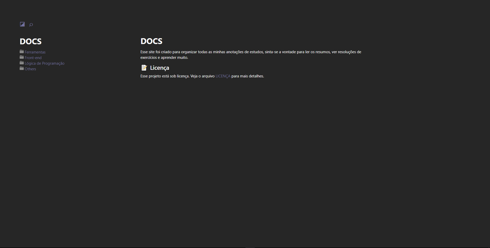

# 📂 Docs

> Esse projeto reune todos os conteúdos que auxiliam meus estudos e resumos criados por mim.

## ☕ Acesse o projeto [aqui](https://levxyca.codes/docs/).

Você pode utilizar o ícone de lupa para buscar algum conteúdo específico ou simplesmente navegar pelas páginas.

## 🤝 Feito com muito carinho

<table>
  <tr>
    <td align="center">
      <a href="#">
         
        
          <b>Leticia Caroline</b>
        
      </a>
    </td>
  </tr>
</table>