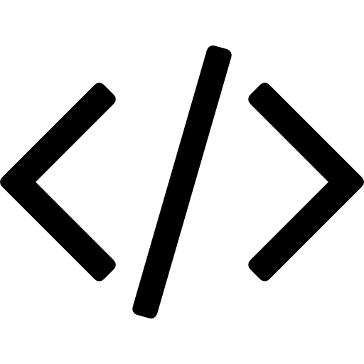

  

<h1 align="center">Anotações de Estudos</h1>

Esse repositório foi criado para organizar todas as minhas anotações de estudos, sinta-se a vontade para ler os resumos, ver resoluções de exercícios e aprender muito.

### Lógica de programação

- #### [Algoritmos](https://github.com/levxyca/studynotes/blob/master/L%C3%B3gica%20de%20Programa%C3%A7%C3%A3o/Algoritmos.md#algoritmos)

### Front-end

- #### [HTML](https://github.com/levxyca/studynotes/blob/master/Desenvolvimento%20Web/html.md#html-b%C3%A1sico)
- #### [CSS](https://github.com/levxyca/studynotes/blob/master/Desenvolvimento%20Web/css.md#css-b%C3%A1sico)

### Linguagens de programação

- #### [C](https://github.com/levxyca/hello-world.c)
- #### [Python](https://github.com/levxyca/studynotes/blob/master/Linguagens%20de%20Programa%C3%A7%C3%A3o/python.md#python)
- #### [Javascript](https://github.com/levxyca/hello-world.js)

### Ferramentas

- #### [Git](https://github.com/levxyca/studynotes/blob/master/Ferramentas/git-github.md#git)
- #### [Github](https://github.com/levxyca/studynotes/blob/master/Ferramentas/git-github.md#git-hub)
