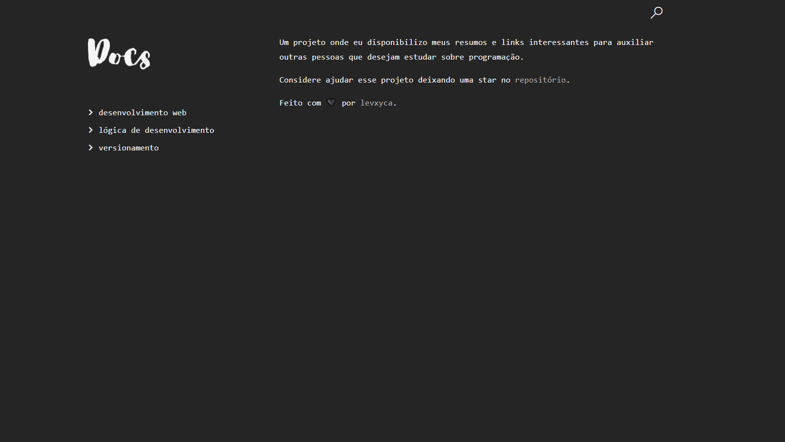

# Docs

> Um projeto onde eu disponibilizo meus resumos e links interessantes para auxiliar outras pessoas que desejam estudar sobre programação.

Feito com 🖤 por [levxyca](https://links.levxyca.codes/).