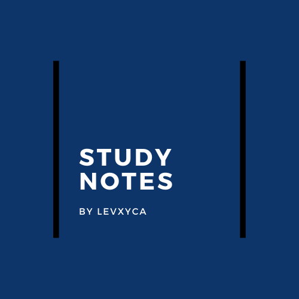

Esse repositório foi criado para organizar todas as minhas anotações de estudos, sinta-se a vontade para ler os resumos, ver resoluções de exercícios e aprender muito.

### Lógica de programação

- #### [Algoritmos]()

### Linguagens de programação

- #### [C]()
- #### [Python]()
- #### [Javascript]()

### Ferramentas

- #### [Git]()
- #### [Github]()
